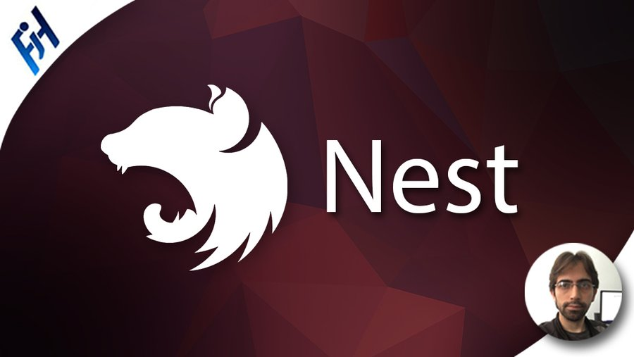

  <h1>Nest.js</h1>
  
  <h3 style="font-weight:bold;" >Curso FH - Nest.js Backend escalable con nodejs (24,5H)</h3>
  <h5></h5>

## Requisitos :clipboard:

*   Conocimiento básico e intermedio de JavaScript es necesario.
*   Conocimiento básico e intermedio de Typescript es necesario.
*   Conocimiento medio o avanzado de programación es necesario.
*   Conocimiento solicitudes http .
*   Poder realizar instalaciones en el equipo como administrador
*   Se puede lanzar el contenido del curso en OSX (Mac), Windows o Linux

## Comenzando 🚀

En este curso se utilizara la rama main para tener todo el contenido unificado y se adjuntara la documentacion necesaria para poder recuperar todas las secciones.

Todos los proyectos seras realizados con variables de entorno y bases de datos locales con docker.

## Descripcion :notebook:
**Aprender Nestjs Actual 2022**
- Este curso tiene por objetivo aprender a realizar proyectos reales con nestjs.
- Este curso está construido 100% en Ts.

### Contenido didactico
**Listado de funcionalidades del backend con Nestjs**
<ul>
    <li>Rest Api</li>
    <li>Auth - Auten - Jwt </li>
    <li>Bases de Datos : MongoDb | TypeOrm | PostgresQl</li>
    <li>Sockets</li>
    <li>Docker</li>
    <li>Documentacion OpenApi</li>
    <li>Despliegue - CD/CI</li>
</ul>

#### Listado de Secciones del Curso: 💯

*   Seccion 01: :gear: [Introduccion curso ](https://github.com/jmrg-link/Nestjs-FH)
*   Seccion 02: :gear: [Conocimientos Generales Ts necesarios ](https://github.com/jmrg-link/Nestjs-FH)
*   Seccion 03: :gear: [Primeros pasos Nest](https://github.com/jmrg-link/Nestjs-FH)
*   Seccion 04: :gear: [DTOs y Validación de información](https://github.com/jmrg-link/Nestjs-FH)
*   Seccion 05: :gear: [Nest CLI Resource - Brands CRUD](https://github.com/jmrg-link/Nestjs-FH)
*   Seccion 06: :gear: [Generar build de producción básico](https://github.com/jmrg-link/Nestjs-FH)
*   Seccion 07: :gear: [MongoDB Pokedex](https://github.com/jmrg-link/Nestjs-FH)
*   Seccion 08: :gear: [Seed y Paginación](https://github.com/jmrg-link/Nestjs-FH)
*   Seccion 09: :gear: [Variables de entorno - Deployment y Dockerizar la aplicación](https://github.com/jmrg-link/Nestjs-FH)
*   Seccion 10: :gear: [TypeORM - Postgres](https://github.com/jmrg-link/Nestjs-FH)
*   Seccion 11: :gear: [Relaciones en TypeORM](https://github.com/jmrg-link/Nestjs-FH)
*   Seccion 12: :gear: [Carga de archivos](https://github.com/jmrg-link/Nestjs-FH)
*   Seccion 13: :gear: [Autentificación e autorizacion](https://github.com/jmrg-link/Nestjs-FH)
*   Seccion 14: :gear: [Documentacion OpenApi](https://github.com/jmrg-link/Nestjs-FH)
*   Seccion 15: :gear: [WebScokets](https://github.com/jmrg-link/Nestjs-FH)
*   Seccion 16: :gear: [Desplegar backend a producción](https://github.com/jmrg-link/Nestjs-FH)
*   Seccion 17: :gear: [Finalización del curso](https://github.com/jmrg-link/Nestjs-FH)
